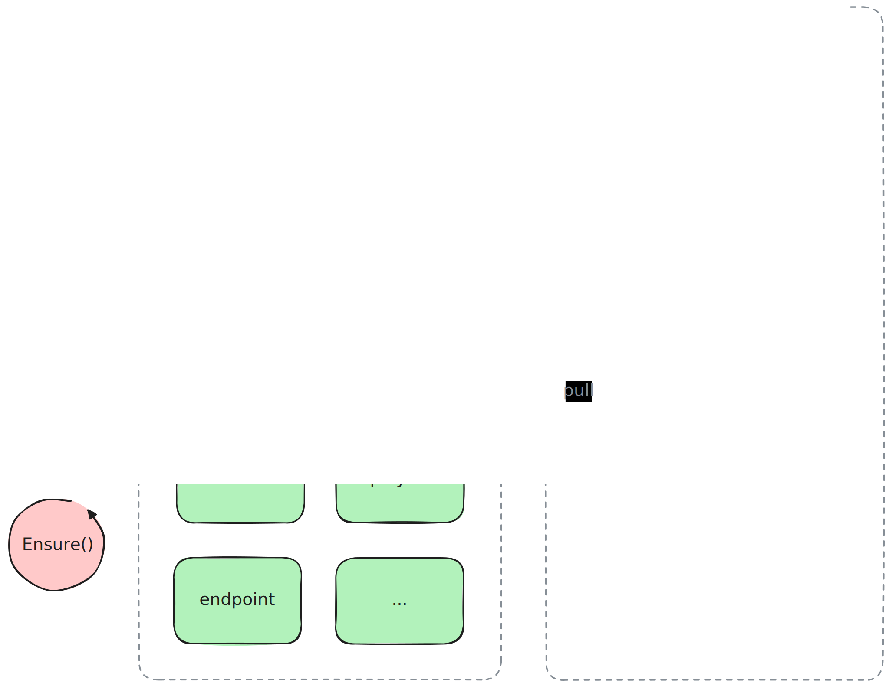
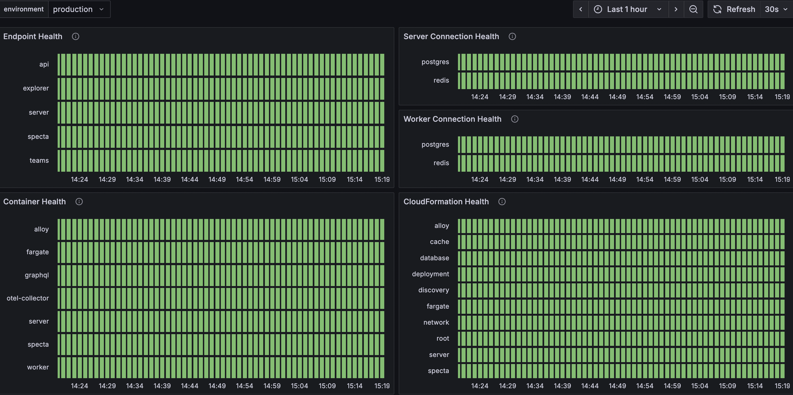

# specta

This repository is the observability backend using the generated Golang code as
defined by the [Specta Protos]. The relevant components here are described by
the `server` and `worker` packages. Amongst other things, Specta provides the
real-time data for our infrastructure status dashboard.



---



### Server

The server is an auto-generated RPC backend serving clients with synchronous
request and response patterns, e.g. `metrics.API/Histogram`.

```
curl -s \
  --request "POST" \
  --header "Content-Type: application/json" \
  --data '{ "action": [ { "metric": "page_ready_duration_seconds", "number": 47 } ] }' \
  http://127.0.0.1:7777/metrics.API/Histogram \
  | jq .
```

```
{
  "result": [
    {
      "status": "success"
    }
  ]
}
```

### Worker

The worker is a custom task engine executing asynchronous worker handlers
iteratively. New worker handlers can be added easily by implementing the handler
interface and registering the handler in the worker engine.

```
type Interface interface {
	// Cooler is the amount of time that any given handler specifies to wait
	// before being executed again. This is not an interval on a strict schedule.
	// This is simply the time to sleep after execution, before another cycle
	// repeats.
	Cooler() time.Duration

	// Ensure executes the handler specific business logic in order to complete
	// the given task, if possible. Any error returned will be emitted using the
	// underlying logger interface. Calling this method will not interfere with
	// the execution of other handlers.
	Ensure() error
}
```

### Usage

At its core, Specta is a simple [Cobra] command line tool, providing e.g. the
daemon command to start the long running `server` and `worker` processes.

```
specta -h
```

```
Golang based RPC microservice.

Usage:
  specta [flags]
  specta [command]

Available Commands:
  daemon      Execute Specta's long running process for exposing RPC handlers.
  version     Print the version information for this command line tool.

Flags:
  -h, --help   help for specta

Use "specta [command] --help" for more information about a command.
```

### Development

Running the Specta daemon requires the environment to be injected via
environment variable with one of these values: `development` `testing` `staging`
`production`. Any other value will cause an early runtime panic.

```
SPECTA_ENVIRONMENT=development specta daemon
```

```
{ "time":"2025-07-04 14:09:06", "level":"info", "message":"daemon is launching procs", "environment":"development", "caller":".../pkg/daemon/daemon.go:38" }
{ "time":"2025-07-04 14:09:06", "level":"info", "message":"server is accepting calls", "address":"127.0.0.1:7777",  "caller":".../pkg/server/server.go:95" }
{ "time":"2025-07-04 14:09:06", "level":"info", "message":"worker is executing tasks", "pipelines":"5",             "caller":".../pkg/worker/worker.go:110" }


```

### Releases

In order to update the Docker image, prepare all desired changes within the
`main` branch and create a Github release for the desired Specta version. The
release tag should be in [Semver Format]. Creating the Github release triggers
the responsible [Github Action] to build and push the Docker image to the
configured [Amazon ECR].

```
v0.1.11
```

The version command `specta version` and the version endpoint `/version` provide build
specific version information about the build and runtime environment. A live demo can
be seen at https://specta.testing.splits.org/version.

# Docker

Specta's build artifact is a statically compiled binary running in a
[distroless] image for maximum security and minimum size. If you do not have Go
installed and just want to run Specta locally in a Docker container, then use
the following commands.

```
docker build \
  --build-arg SHA="local-test-sha" \
  --build-arg TAG="local-test-tag" \
  -t specta:local .
```

```
docker run \
  -e SPECTA_ENVIRONMENT=development \
  -p 7777:7777 \
  specta:local \
  daemon
```

[Amazon ECR]: https://docs.aws.amazon.com/ecr
[Cobra]: https://github.com/spf13/cobra
[distroless]: https://github.com/GoogleContainerTools/distroless
[Github Action]: .github/workflows/docker-release.yaml
[Semver Format]: https://semver.org
[Specta Protos]: https://github.com/0xSplits/spectaprotos
